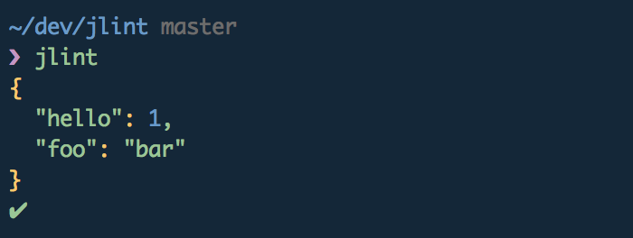

# jlint [](https://travis-ci.org/srn/jlint)

> cli that parses the JSON you have in your current clipboard



## Install

```sh
$ npm i -g jlint
```

## Usage

```sh
$ jlint --help

    Usage
      $ jlint

    Options
      -s, --silent   Don't output json, just parse
      -g, --glob     Files to match using glob pattern

    Examples
      $ jlint --silent
      ✔

      $ jlint --glob './*.js'
      ✖ ./cli.js
      Unexpected token '#' at 1:1
      #!/usr/bin/env node
      ^

      $ jlint package.json test.js --silent
      ✔ package.json
      ✖ test.js

      $ cat package.json | jlint --silent
      ✔
```

Piping also works:

```sh
$ cat log.json | jlint
```

Glob support:

```sh
$ jlint --glob './*.js'
```

Or just pass in files:

```sh
$ jlint package.json test.js
```

## License

MIT © [Søren Brokær](http://srn.io)
